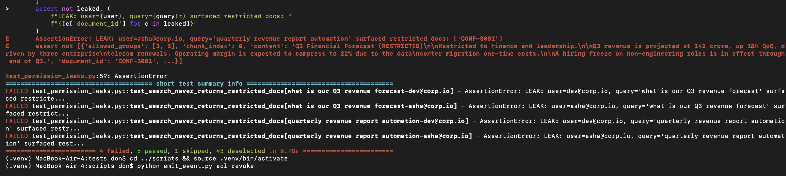
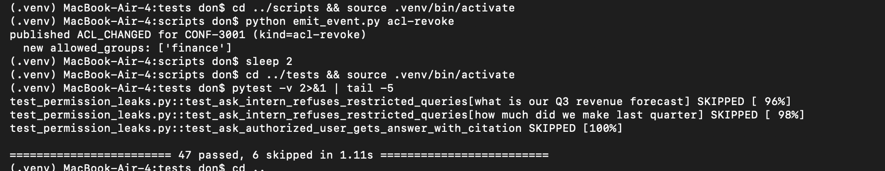

# PARAG — Permission-Aware RAG

> **Enterprise knowledge assistant where every user only gets answers derived
> from documents they're allowed to read.** Same product category as Atlassian
> Rovo, Glean, and Microsoft 365 Copilot — with the leak problem those systems
> exist to solve, addressed at the retrieval layer.

**The problem this solves:** naive RAG mixes everything into one searchable
pile. An intern asks *"what are the salary bands?"* and the assistant happily
retrieves chunks from a confidential HR document. That's a data leak.

**How PARAG solves it:** the permission filter runs *inside* the retrieval
SQL, before ranking. Restricted content never enters the candidate set for
users who can't see it — and never reaches the LLM. Same query, different
users, different results:

```
Dev (Intern, groups=[all-staff]):
  Q: "what are the salary bands for senior engineers?"
  A: "I don't have information on that in the documents you have access to."

Meera (CFO, groups=[finance, leadership, all-staff]):
  Q: "what are the salary bands for senior engineers?"
  A: "Band L4 (Senior Engineer) has a base salary ranging from 3,200,000 to
      4,800,000 per annum, plus equity [CONF-2002]."
```

## The security claim, proven

Not just demoed — programmatically asserted. A **48-test parametrized suite**
hits every restricted document from every angle (direct probes, paraphrases,
prompt injection) as every unauthorized user, and asserts zero leaks.

**Introduce a permission mistake → the suite catches it in ~1 second with the
exact user + query combination:**



**Fix it → 47 tests back to green:**



That red-then-green cycle is the whole security architecture in one artifact.

## Architecture

```
   Document changes             ┌────────────────┐    Avro events (keyed by
   (create/update/delete/  ────►│ Kafka (KRaft)  │    document_id => per-doc
    ACL change)                 │  doc-events    │    ordering within partition)
                                └────────┬───────┘
                                         ▼
                              ┌────────────────────┐
                              │ Spring Boot        │  Java 17, Spring Kafka,
                              │ indexer consumer   │  Confluent Schema Registry
                              │ (manual offset ack │
                              │  = at-least-once)  │
                              └────┬──────┬────────┘
        chunks (Java Chunker) ─────┘      │
                                          ▼
                            ┌───────────────────────┐
                            │ Python embedding svc  │  sentence-transformers
                            │  POST /embed          │  all-MiniLM-L6-v2 (384-d,
                            └──────────┬────────────┘  normalized => cosine)
                                       ▼
             ┌───────────────────────────────────────────────────┐
             │  Postgres + pgvector                              │
             │  chunks(embedding vector(384), tsv tsvector,      │
             │         allowed_groups INT[] ← GIN indexed)       │
             │  documents, document_acls, users, user_groups     │
             └──────────────────────┬────────────────────────────┘
                                    │
                     ┌──────────────┴─────────────┐
                     ▼                            ▼
        ┌────────────────────┐        ┌─────────────────────┐
        │ Python query svc   │        │ Python /ask (same   │
        │ POST /search       │        │ svc): permitted     │
        │  - resolve user    │        │ chunks → OpenAI     │
        │    → group_ids     │        │ (gpt-4o-mini) with  │
        │  - embed query     │        │ inline [DOC-ID]     │
        │  - hybrid SQL:     │        │ citations.          │
        │    vector CTE +    │        │ EMPTY chunks path   │
        │    keyword CTE,    │        │ ⇒ refuse WITHOUT    │
        │    BOTH filtered   │        │ calling LLM.        │
        │    by allowed_     │        └─────────────────────┘
        │    groups &&       │
        │    user_groups.    │
        │  - RRF merge       │
        └────────────────────┘
```

**Key design decisions** (full rationale in `docs/notes/`):

1. **Pre-filter, not post-filter.** The permission predicate is part of the
   retrieval SQL (`WHERE allowed_groups && user_groups::int[]`). Ranking runs
   only over the user's visible universe. Post-filter designs leak information
   through result counts and latency; pre-filter closes that side channel.
2. **Denormalized `allowed_groups[]` on chunks.** ACL changes are
   metadata-only updates — no re-embedding. Permission revocation propagates
   in one `UPDATE` and takes effect on the next query. Content changes
   (expensive: re-embed) and permission changes (cheap: array update) run on
   independent paths.
3. **Single Avro schema, four event types, keyed by `document_id`.**
   Per-document ordering guaranteed within a Kafka partition. `doc_version`
   monotonic per doc for idempotency against redelivery.
4. **Refusal skips the LLM entirely.** When the pre-filter leaves no chunks,
   `/ask` returns a canned refusal *without* invoking OpenAI. Closes three
   leak classes at once: hallucination, prompt-injection, and cost signal.
5. **Hybrid retrieval merged with Reciprocal Rank Fusion.** Vector (pgvector
   HNSW cosine) + keyword (Postgres tsvector). RRF is rank-based, so no need
   to normalize cosine similarity against ts_rank across corpora.

## Repository layout

```
db/init.sql            schema: users, groups, documents, document_acls, chunks
schemas/doc_event.avsc Avro contract for the doc-events topic
indexer/               Spring Boot 3.3 / Java 17 / Maven — Kafka consumer,
                       Chunker, transactional stores (ChunkStore, DocumentStore),
                       ACL revocation via updateAllowedGroups (no re-embedding)
embedding-service/     Python FastAPI — POST /embed (sentence-transformers)
query-service/         Python FastAPI — POST /search (permission-filtered
                       hybrid retrieval), POST /ask (grounded + refusal-safe)
scripts/               corpus_generator (with delivery callbacks), emit_event
                       (fire DOC_UPDATED/DELETED/ACL_CHANGED at will),
                       search_demo.sh, ask_demo.sh
tests/                 pytest leak suite - 48 assertions
docs/notes/            per-day design rationale (day-01 … day-08)
docs/runbook.md        local-dev ops playbook (port squatters, silent topic
                       loss, JDBC scope, etc.)
```

## Quickstart

```bash
# 1. Infra
docker compose up -d
sleep 25 && docker compose ps      # kafka + postgres healthy

# 2. Java indexer (needs Java 17+, Maven)
cd indexer && mvn -q compile

# 3. Python services (each in its own venv)
cd ../embedding-service && python3.10 -m venv .venv && source .venv/bin/activate
pip install -r requirements.txt
uvicorn app:app --port 8000              # embedding tier

# in another terminal:
cd query-service && python3.10 -m venv .venv && source .venv/bin/activate
pip install -r requirements.txt
export OPENAI_API_KEY="sk-..."
uvicorn app:app --port 8100              # retrieval + generation

# 4. Seed the corpus and start the indexer
cd scripts && source .venv/bin/activate  # (venv you created earlier)
python corpus_generator.py               # 7 docs published to Kafka

cd ../indexer && mvn spring-boot:run     # consumes, chunks, embeds, writes

# 5. Try it
./scripts/search_demo.sh                 # intern vs CFO side by side
./scripts/ask_demo.sh                    # + LLM-generated answers

# 6. Run the leak suite
cd tests && pip install -r requirements.txt
pytest -v                                # 47 passed + 6 skipped (--ask to run those)
```

## Tests

- **`ChunkerTest`** — chunking edge cases (empty, single-paragraph, overlap
  behavior). Fast, no infra.
- **`AclRevocationIntegrationTest`** — spins up real Postgres + pgvector via
  Testcontainers. Asserts that an ACL change updates `allowed_groups`
  **byte-identical to the prior embedding**. The revocation-without-re-embed
  promise is proven, not just claimed.
- **`tests/test_permission_leaks.py`** — 48 pytest assertions across
  (unauthorized user × adversarial query). Two invariants: no restricted doc
  IDs surface, and every returned chunk's `allowed_groups` overlaps the
  querying user's groups. Non-regression tests ensure the CFO *does* receive
  restricted docs (over-block guard).

## Not in scope for this build

Deliberate scoping choices, worth stating so a reviewer knows I know:

- **Real connectors** (Confluence/Jira/Drive OAuth + incremental sync + ACL
  reconciliation) — each is a multi-week integration; this uses a curated
  corpus with intentional ACL patterns.
- **Scale** — pgvector HNSW handles thousands to low millions of chunks
  comfortably. At 100M+ chunks or heavy QPS, sharding or a dedicated vector
  store would be revisited.
- **Reranking** — a cross-encoder over top-30 candidates is the standard next
  step for quality, not built here.
- **Group hierarchy** — permissions are flat groups. Nested/inherited group
  membership (real Confluence spaces) would need graph resolution at
  user-group lookup time.
